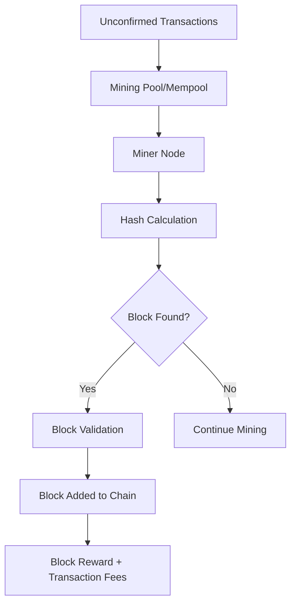
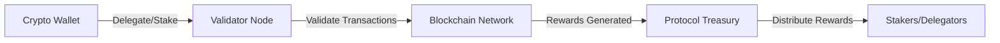

# ⛏️ Mining dan Staking Crypto Indonesia: Panduan Lengkap 2025

> **"Cara menghasilkan crypto dengan memvalidasi transaksi - dari mining GPU hingga staking validator"**

---

## 🎯 Panduan Ini Untuk Siapa?

- **👥 Crypto Enthusiasts Indonesia** - Yang mau mining atau staking crypto
- **💻 Tech Savvy Users** - Yang punya resources teknis untuk mining
- **💰 Long-term Investors** - Yang mau staking untuk passive income
- **🏢 Small Business Owners** - Yang mau diversify income streams
- **🎓 Students** - Yang mau belajar blockchain mechanics
- **🔧 IT Professionals** - Yang punya akses ke hardware dan internet

---

## 📊 Data Mining & Staking 2025: Market Overview

```python
mining_staking_market_2025 = {
    "global_mining_revenue": "$28.5 miliar per tahun",
    "global_staking_rewards": "$45.2 miliar per tahun",
    "indonesian_miners": "125,000+ aktif",
    "indonesian_stakers": "380,000+ aktif",
    "popular_coins": {
        "mining": ["Bitcoin", "Kaspa", "Nexa", "Radiant"],
        "staking": ["Ethereum", "Solana", "Cardano", "Polkadot"]
    },
    "indonesian_advantages": {
        "electricity_cost": "$0.08-0.12 per kWh",
        "climate": "Tropical (cooling natural)",
        "renewable_energy": "Growing solar adoption",
        "community_support": "Strong local mining communities"
    }
}
```

---

## 🔍 Fundamental Mining: Apa Itu Crypto Mining?

### 💡 Konsep Dasar
**Crypto Mining** = Proses validasi transaksi blockchain menggunakan computational power untuk menyelesaikan cryptographic puzzles dan mendapatkan block rewards.

### 🏗️ Cara Kerja Mining


### 📋 Jenis-Jenis Mining

#### 1. **Proof-of-Work (PoW) Mining**
```python
pow_mining_characteristics = {
    "mechanism": "Computational puzzle solving",
    "hardware_required": ["ASIC", "GPU", "CPU"],
    "energy_consumption": "Very High",
    "reward_type": "Block rewards + transaction fees",
    "examples": ["Bitcoin", "Kaspa", "Monero", "Litecoin"]
}
```

#### 2. **Proof-of-Stake (PoS) Staking**
```python
pos_staking_characteristics = {
    "mechanism": "Token lockup for network security",
    "hardware_required": ["Basic computer", "Stable internet"],
    "energy_consumption": "Very Low",
    "reward_type": "Network inflation + transaction fees",
    "examples": ["Ethereum", "Solana", "Cardano", "Polkadot"]
}
```

#### 3. **Hybrid Mechanisms**
```python
hybrid_mechanisms = {
    "proof_of_capacity": "Storage space (Burst, Chia)",
    "proof_of_space": "Disk space allocation",
    "proof_of_coverage": "Network participation (Helium)",
    "delegated_proof_of_stake": "Voting delegation (Tron)"
}
```

---

## ⚡ Mining di Indonesia: Panduan Praktis

### 🏠 Home Mining Setup

#### **Minimum Requirements untuk GPU Mining**
```python
gpu_mining_requirements = {
    "hardware": {
        "gpu": "RTX 3060 / RX 6600 XT or better",
        "cpu": "Modern dual-core or better",
        "ram": "8GB DDR4 minimum",
        "storage": "120GB SSD",
        "power_supply": "750W+ 80+ Gold",
        "cooling": "Good case fans + room ventilation"
    },
    "electricity": {
        "monthly_cost": "Rp 1-2 juta untuk 6 GPU rig",
        "stable_power": "CRITICAL - no frequent outages",
        "voltage_stability": "220V with surge protector"
    },
    "internet": {
        "speed": "10 Mbps+ stable connection",
        "data_cap": "Unlimited or high quota",
        "reliability": "99%+ uptime needed"
    }
}
```

#### **ASIC Mining Requirements**
```python
asic_mining_requirements = {
    "bitcoin_asic": {
        "popular_models": ["Antminer S19", "Whatsminer M30S"],
        "power_consumption": "3250W per unit",
        "hasrate": "110 TH/s",
        "cost": "$3,000-5,000 per unit",
        "roi_timeline": "12-18 months"
    },
    "kawpow_asic": {
        "popular_models": ["Goldshell KD-Box", "Ipollo V1"],
        "power_consumption": "120W per unit",
        "hasrate": "500 MH/s",
        "cost": "$800-1,200 per unit",
        "roi_timeline": "8-12 months"
    }
}
```

### 🏭 Industrial Mining Considerations

#### **Large Scale Mining (50+ GPUs)**
```python
industrial_mining_factors = {
    "location": {
        "industrial_areas": "Cikarang, Bekasi, Surabaya",
        "rural_areas": "Lower electricity costs",
        "cooling_advantages": "Mountain regions",
        "infrastructure": "Need 3-phase power"
    },
    "regulations": {
        "business_license": "Required for commercial operations",
        "electricity_tariff": "Industrial rates apply",
        "environmental": "May need impact assessment",
        "taxation": "Corporate income tax applies"
    },
    "operational_costs": {
        "electricity": "60-70% of total costs",
        "maintenance": "15-20% of total costs",
        "labor": "10-15% of total costs",
        "facilities": "5-10% of total costs"
    }
}
```

### 💰 Mining Profitability Analysis

#### **GPU Mining Profit Calculator 2025**
```python
gpu_mining_profitability = {
    "rtx_4070": {
        "algorithm": "Kaspa (KHeavyHash)",
        "hasrate": "1.2 GH/s",
        "power_draw": "200W",
        "daily_revenue": "$2.80-3.20",
        "electricity_cost": "$0.48 per day",
        "net_profit": "$2.32-2.72 per day",
        "roi_timeline": "9-11 months"
    },
    "rx_6700_xt": {
        "algorithm": "Nexa (SHA512-256d)",
        "hasrate": "980 MH/s",
        "power_draw": "180W",
        "daily_revenue": "$2.10-2.40",
        "electricity_cost": "$0.43 per day",
        "net_profit": "$1.67-1.97 per day",
        "roi_timeline": "10-12 months"
    }
}
```

---

## 🎯 Staking Crypto: Passive Income dengan Modal Minimal

### 💡 Konsep Staking Dasar
**Staking** = Mengunci (lock) crypto asset untuk mendukung operasi blockchain dan mendapatkan rewards dalam bentuk token baru.

### 🏗️ Cara Kerja Staking


### 📋 Metode Staking

#### 1. **Exchange Staking (Paling Mudah)**
```python
exchange_staking_pros_cons = {
    "advantages": [
        "No technical knowledge required",
        "One-click staking",
        "Automatic rewards",
        "No maintenance needed"
    ],
    "disadvantages": [
        "Lower rewards (exchange takes cut)",
        "Custodial risk (not your keys)",
        "Limited coin options",
        "Withdrawal restrictions"
    ],
    "popular_exchanges": [
        "Binance (BNB, ETH, SOL)",
        "Tokocrypto (ETH, ADA)",
        "Indodax (limited options)",
        "Pintu (growing options)"
    ]
}
```

#### 2. **Hardware Wallet Staking (Medium Security)**
```python
hardware_wallet_staking = {
    "devices": ["Ledger", "Trezor", "SafePal"],
    "software": [
        "Ledger Live",
        "Trezor Suite",
        "External validators"
    ],
    "advantages": [
        "High security",
        "Full control",
        "Better rewards than exchanges"
    ],
    "disadvantages": [
        "Technical setup required",
        "Device cost ($50-200)",
        "Limited delegation options"
    ]
}
```

#### 3. **Self-Validation (Advanced)**
```python
self_validation_requirements = {
    "ethereum": {
        "minimum_stake": "32 ETH",
        "hardware": "Good computer + stable internet",
        "technical_skill": "Advanced",
        "rewards": "Maximum possible",
        "responsibilities": "24/7 uptime, maintenance"
    },
    "solana": {
        "minimum_stake": "SOL + vote stake",
        "hardware": "Good CPU + RAM + SSD",
        "technical_skill": "Medium",
        "rewards": "High",
        "responsibilities": "Software updates, monitoring"
    }
}
```

---

## 🇮🇩 Staking di Indonesia: Panduan Lokal

### 💰 Popular Staking Coins di Indonesia
```python
indonesian_staking_popularity = {
    "ethereum": {
        "apy": "3.5-5.5%",
        "minimum": "0.1 ETH",
        "popularity": "Very High",
        "risks": "Low to Medium"
    },
    "solana": {
        "apy": "6-8%",
        "minimum": "0.1 SOL",
        "popularity": "High",
        "risks": "Medium"
    },
    "cardano": {
        "apy": "4-6%",
        "minimum": "10 ADA",
        "popularity": "Medium",
        "risks": "Low"
    },
    "polkadot": {
        "apy": "12-15%",
        "minimum": "1 DOT",
        "popularity": "Growing",
        "risks": "Medium"
    }
}
```

### 🏛️ Legal dan Perpajakan di Indonesia
```python
indonesian_regulatory_framework = {
    "legal_status": {
        "crypto_mining": "Legal as business activity",
        "crypto_staking": "Considered as investment",
        "trading": "Legal through registered exchanges",
        "mining_business": "Need business license"
    },
    "taxation": {
        "mining_income": "Corporate income tax 22%",
        "staking_rewards": "Capital gains tax",
        "electricity": "Commercial rates for mining operations",
        "equipment_import": "Import duties may apply"
    },
    "compliance": {
        "business_registration": "Required for commercial operations",
        "reporting": "Financial reporting required",
        "aml_kyc": "Required for exchange operations",
        "environmental": "Power consumption reporting"
    }
}
```

---

## 🛠️ Practical Setup Guides

### 🎮 GPU Mining Setup Step-by-Step

#### **Langkah 1: Hardware Assembly**
```python
mining_rig_assembly_steps = [
    "1. Install motherboard ke case",
    "2. Install CPU dan RAM",
    "3. Install SSD dengan OS",
    "4. Install riser cables dan GPU",
    "5. Connect power supply ke semua komponen",
    "6. Install cooling fans",
    "7. Connect internet cable",
    "8. Power on dan test"
]
```

#### **Langkah 2: Software Installation**
```python
mining_software_setup = {
    "operating_system": [
        "Windows 10/11 (user friendly)",
        "Linux (HiveOS, RaveOS - optimal)",
        "SimpleMining (paid but easy)"
    ],
    "mining_software": [
        "LOKILUNER (Kaspa, Nexa)",
        "T-Rex (KawPoW, Octopus)",
        "NBMiner (Ethereum Classic, RVN)",
        "Gminer (multiple algorithms)"
    ],
    "monitoring_tools": [
        "Awesome Miner (management)",
        "HiveOS dashboard",
        "MiningPoolHub stats",
        "GPU-Z (monitoring)"
    ]
}
```

#### **Langkah 3: Pool Selection**
```python
mining_pools_comparison = {
    "popular_pools": {
        "f2pool": {
            "fees": "2.5%",
            "servers": "Asia, Europe, US",
            "payout_threshold": "0.01 BTC",
            "reputation": "Excellent"
        },
        "poolin": {
            "fees": "2.5%",
            "servers": "Global",
            "payout_threshold": "0.001 BTC",
            "reputation": "Very Good"
        },
        "via_btc": {
            "fees": "2%",
            "servers": "Asia focused",
            "payout_threshold": "0.001 BTC",
            "reputation": "Good"
        }
    }
}
```

### 🔑 Staking Setup Step-by-Step

#### **Staking di Exchange (Pemula)**
```python
exchange_staking_steps = [
    "1. Daftar di exchange (Binance, Tokocrypto)",
    "2. Deposit crypto yang mau di-stake",
    "3. Navigate ke staking section",
    "4. Pilih coin dan amount",
    "5. Confirm staking",
    "6. Monitor rewards di wallet"
]
```

#### **Staking dengan Hardware Wallet (Medium)**
```python
hardware_wallet_staking_steps = [
    "1. Setup hardware wallet (Ledger/Trezor)",
    "2. Install coin app di device",
    "3. Connect ke wallet software",
    "4. Find validator/staking service",
    "5. Delegate stake ke validator",
    "6. Confirm transaction di hardware wallet",
    "7. Monitor rewards"
]
```

---

## 💰 Investment Analysis & ROI

### ⚡ Mining ROI Projections 2025
```python
mining_roi_analysis = {
    "small_scale_6gpu": {
        "initial_investment": "$3,000-4,000",
        "monthly_revenue": "$180-220",
        "monthly_costs": "$90-120",
        "net_profit": "$90-100 per month",
        "payback_period": "30-40 months",
        "risk_factors": ["Bitcoin halving", "Electricity cost increase", "Difficulty rise"]
    },
    "medium_scale_30gpu": {
        "initial_investment": "$15,000-20,000",
        "monthly_revenue": "$900-1,100",
        "monthly_costs": "$450-600",
        "net_profit": "$450-500 per month",
        "payback_period": "30-40 months",
        "economies_of_scale": "Better per-unit profitability"
    },
    "asic_bitcoin": {
        "initial_investment": "$12,000-15,000 (3 units)",
        "monthly_revenue": "$1,200-1,500",
        "monthly_costs": "$720-900",
        "net_profit": "$480-600 per month",
        "payback_period": "20-25 months",
        "concentration_risk": "Bitcoin dependent"
    }
}
```

### 🎯 Staking ROI Projections 2025
```python
staking_roi_analysis = {
    "conservative_portfolio": {
        "allocation": "60% ETH, 40% SOL",
        "expected_apy": "4.5-6.5%",
        "risk_level": "Low to Medium",
        "volatility": "Moderate",
        "best_for": "Long-term holders"
    },
    "aggressive_portfolio": {
        "allocation": "30% ETH, 30% SOL, 20% DOT, 20% ATOM",
        "expected_apy": "8-12%",
        "risk_level": "Medium to High",
        "volatility": "High",
        "best_for": "Risk-tolerant investors"
    },
    "stable_income_portfolio": {
        "allocation": "80% stablecoins staking, 20% ETH",
        "expected_apy": "5-8%",
        "risk_level": "Low",
        "volatility": "Low",
        "best_for": "Income-focused investors"
    }
}
```

---

## 🛡️ Risk Management

### ⚠️ Mining Risks
```python
mining_risk_factors = {
    "market_risks": [
        "Bitcoin price volatility",
        "Mining difficulty increases",
        "Block reward halvings",
        "Network algorithm changes"
    ],
    "operational_risks": [
        "Hardware failure",
        "Power outages",
        "Internet connectivity issues",
        "Cooling system failures"
    ],
    "financial_risks": [
        "Electricity cost increases",
        "Mining equipment depreciation",
        "Maintenance costs",
        "Regulatory changes"
    ],
    "environmental_risks": [
        "Heat damage to equipment",
        "Humidity damage",
        "Dust accumulation",
        "Natural disasters"
    ]
}
```

### 🎯 Staking Risks
```python
staking_risk_factors = {
    "market_risks": [
        "Token price depreciation",
        "Reward rate reductions",
        "Inflation adjustments",
        "Market liquidity issues"
    ],
    "technical_risks": [
        "Smart contract vulnerabilities",
        "Validator downtime/penalties",
        "Network upgrades/forks",
        "Custodial risks (exchange)"
    ],
    "liquidity_risks": [
        "Unstaking lockup periods",
        "Withdrawal queue delays",
        "Market sell pressure",
        "Limited exit options"
    ]
}
```

---

## 🚀 Future Trends 2025-2026

### 🔮 Mining Evolution
```python
mining_future_trends = {
    "efficiency_improvements": [
        "Next-gen ASICs (lower power, higher hash)",
        "Immersion cooling adoption",
        "Renewable energy integration",
        "AI-optimized mining operations"
    ],
    "algorithm_shifts": [
        "PoW to PoS conversions",
        "ASIC-resistant algorithms",
        "Hybrid consensus mechanisms",
        "Environmental focus"
    ],
    "regulatory_developments": [
        "Carbon footprint regulations",
        "Mining licensing requirements",
        "Energy consumption reporting",
        "International cooperation"
    ]
}
```

### 🌟 Staking Evolution
```python
staking_future_trends = {
    "liquid_staking": [
        "Derivative tokens for staked assets",
        "Lending protocols for staked collateral",
        "Composability with DeFi",
        "Increased liquidity options"
    ],
    "institutional_adoption": [
        "Enterprise staking services",
        "Insurance products for staking",
        "Regulatory clarity improvements",
        "Tax-efficient structures"
    ],
    "technical_innovations": [
        "DVT (Distributed Validator Technology)",
        "MEV optimization strategies",
        "Cross-chain staking protocols",
        "Automated validator management"
    ]
}
```

---

## 🎓 Kesimpulan: Mining & Staking di Indonesia

### 💡 Key Takeaways
1. **Mining memerlukan investasi hardware** dan technical knowledge
2. **Staking lebih accessible** untuk kebanyakan orang
3. **Indonesia punya potensi mining** karena listrik relatif murah
4. **Profitability sangat tergantung** pada market conditions
5. **Risk management essential** untuk kedua strategi

### 🎯 Action Plan
```python
mining_staking_action_plan = [
    "💰 Tentukan budget dan risk tolerance",
    "🔥 Pilih antara mining vs staking (atau kombinasi)",
    "🏠 Mulai dengan skala kecil untuk testing",
    "📊 Monitor profitability secara regular",
    "🛡️ Implement risk management strategies",
    "🌐 Join komunitas mining/staking Indonesia",
    "📈 Scale up berdasarkan hasil dan experience"
]
```

---

## 🔗 Useful Links & Resources

### 🌐 Mining Resources
- [WhatToMine](https://whattomine.com) - Mining profitability calculator
- [MiningPoolStats](https://miningpoolstats.stream) - Pool statistics
- [HiveOS](https://hiveos.farm) - Mining OS
- [Awesome Miner](https://awesomeminer.com) - Mining management

### 🎯 Staking Resources
- [Staking Rewards](https://stakingrewards.com) - Staking APY comparison
- [Validator Nodes](https://www.validators.app) - Validator information
- [Ledger Staking](https://www.ledger.com/staking) - Hardware wallet staking
- [Binance Staking](https://www.binance.com/staking) - Exchange staking

### 🇮🇩 Indonesian Communities
- [IndoMiners Telegram](https://t.me/indominers)
- [Crypto Mining Indonesia Facebook Group](https://facebook.com/groups/cryptominingindonesia)
- [Blockchain Indonesia Forum](https://blockchain-id.org)
- [Binance Indonesian Community](https://t.me/binanceindonesia)

---

> ⛏️ **"Mining dan staking adalah cara untuk participate di blockchain economy. Pilih sesuai kemampuan teknis dan financial capacity Anda. Selalu prioritize keamanan dan risk management."**

---

*Updated: September 2025 | Mining & Staking Guide for Indonesian Users | Part of Complete Financial Markets Knowledge Base*