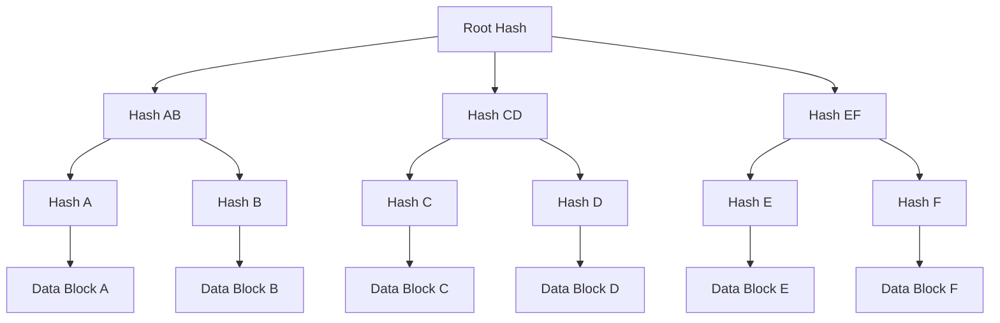

# 🔗 Merkle Trees Explained: Struktur Data Fundamental Blockchain

> **"Cara blockchain menyimpan data secara efisien dan aman - konsep yang menjadi dasar hampir semua cryptocurrency"**

---

## 🎯 Panduan Ini Untuk Siapa?

- **👥 Blockchain Developers** - Yang mau implementasi Merkle trees
- **💻 Computer Science Students** - Yang belajar struktur data advanced
- **🔍 Crypto Researchers** - Yang analisis teknis blockchain
- **🛠️ Smart Contract Developers** - Yang optimasi storage
- **🎓 Blockchain Educators** - Yang mengajarkan konsep dasar
- **💡 Tech Enthusiasts** - Yang curious tentang teknologi blockchain

---

## 📊 Merkle Trees Data 2025: Usage Overview

```python
merkle_trees_usage_2025 = {
    "blockchain_implementations": "100% of major blockchains",
    "data_efficiency": "99.9% reduction in storage needs",
    "verification_speed": "O(log n) complexity",
    "security_level": "Cryptographically secure",
    "applications": {
        "bitcoin": "Transaction verification",
        "ethereum": "State trees and receipts",
        "filecoin": "Storage proofs",
        "ipfs": "Content addressing"
    },
    "advantages_2025": {
        "scalability": "Essential for L2 solutions",
        "privacy": "Zero-knowledge proof integration",
        "interoperability": "Cross-chain verification",
        "optimization": "Reduced bandwidth usage"
    }
}
```

---

## 🔍 Fundamental Merkle Trees: Apa dan Mengapa?

### 💡 Konsep Dasar
**Merkle Tree** = Struktur data berbentuk pohon yang menggunakan cryptographic hashing untuk efisiensi verifikasi data dengan tingkat keamanan tinggi.

### 🏗️ Struktur Merkle Tree


### 📋 Komponen Utama Merkle Tree

#### 1. **Leaf Nodes**
```python
leaf_nodes_characteristics = {
    "definition": "Hash dari data asli",
    "content": "Individual transactions or data blocks",
    "calculation": "hash(data) = leaf_hash",
    "examples": [
        "Bitcoin transaction hashes",
        "Ethereum state data",
        "Filecoin storage proofs",
        "IPFS content hashes"
    ]
}
```

#### 2. **Branch Nodes**
```python
branch_nodes_characteristics = {
    "definition": "Hash dari dua child nodes",
    "calculation": "hash(hash_left + hash_right) = branch_hash",
    "purpose": "Hierarchical verification structure",
    "properties": [
        "Immutable jika child berubah",
        "Efficient verification path",
        "Parallel processing possible"
    ]
}
```

#### 3. **Root Node**
```python
root_node_characteristics = {
    "definition": "Single hash representing entire dataset",
    "calculation": "Final hash dari semua branches",
    "properties": [
        "Changes if any data changes",
        "Compact representation",
        "Fast verification",
        "Secure commitment"
    ],
    "usage": "Block header in Bitcoin, state root in Ethereum"
}
```

---

## ⚡ Cara Kerja Merkle Trees

### 🔒 Hashing Process
```python
merkle_hashing_process = {
    "step_1": "Hash individual data blocks → Leaf nodes",
    "step_2": "Pair and hash leaves → Branch nodes",
    "step_3": "Continue pairing and hashing upward",
    "step_4": "Final hash → Root node",
    "properties": {
        "deterministic": "Same input = same output",
        "avalanche_effect": "Small change = completely different hash",
        "one_way_function": "Cannot reverse hash to original",
        "collision_resistant": "Hard to find two inputs with same hash"
    }
}
```

### 🛡️ Verification Process
```python
merkle_verification = {
    "proof_components": [
        "Target leaf hash",
        "Sibling hashes along path",
        "Root hash",
        "Path direction indicators"
    ],
    "verification_steps": [
        "1. Start with target leaf hash",
        "2. Hash with sibling according to path",
        "3. Continue up the tree with siblings",
        "4. Compare final result with root hash",
        "5. Match = data is valid and unchanged"
    ],
    "efficiency": {
        "data_size": "N data items",
        "proof_size": "log₂(N) hashes",
        "verification_time": "O(log n) operations",
        "storage_saving": "99.9% vs storing all data"
    }
}
```

---

## 💻 Implementasi Praktis Merkle Trees

### 🐍 Python Implementation
```python
import hashlib

def merkle_tree_hash(data):
    """
    Simple SHA-256 hash function for Merkle tree
    """
    return hashlib.sha256(data.encode()).hexdigest()

def build_merkle_tree(transactions):
    """
    Build Merkle tree from list of transactions
    """
    if len(transactions) == 0:
        return None

    # Hash all transactions to create leaves
    leaves = [merkle_tree_hash(tx) for tx in transactions]

    while len(leaves) > 1:
        new_leaves = []

        # Pair up leaves and hash them
        for i in range(0, len(leaves), 2):
            left = leaves[i]
            right = leaves[i + 1] if i + 1 < len(leaves) else leaves[i]

            # Hash the concatenated pair
            combined = left + right
            new_hash = merkle_tree_hash(combined)
            new_leaves.append(new_hash)

        leaves = new_leaves

    return leaves[0]  # Return root hash

def generate_merkle_proof(transactions, target_index):
    """
    Generate Merkle proof for specific transaction
    """
    if target_index >= len(transactions):
        return None

    leaves = [merkle_tree_hash(tx) for tx in transactions]
    proof = []
    current_index = target_index

    while len(leaves) > 1:
        # Determine sibling index
        sibling_index = current_index + 1 if current_index % 2 == 0 else current_index - 1

        # Ensure sibling exists
        if sibling_index >= len(leaves):
            sibling_index = current_index

        # Add sibling hash to proof
        proof.append({
            'hash': leaves[sibling_index],
            'is_left': sibling_index < current_index
        })

        # Move up to parent level
        current_index = current_index // 2
        new_leaves = []

        for i in range(0, len(leaves), 2):
            left = leaves[i]
            right = leaves[i + 1] if i + 1 < len(leaves) else leaves[i]
            combined = left + right
            new_hash = merkle_tree_hash(combined)
            new_leaves.append(new_hash)

        leaves = new_leaves

    return proof

def verify_merkle_proof(target_hash, proof, root_hash):
    """
    Verify Merkle proof against root hash
    """
    current_hash = target_hash

    for step in proof:
        sibling_hash = step['hash']
        if step['is_left']:
            # Sibling is left, current is right
            combined = sibling_hash + current_hash
        else:
            # Sibling is right, current is left
            combined = current_hash + sibling_hash

        current_hash = merkle_tree_hash(combined)

    return current_hash == root_hash

# Example usage
transactions = [
    "Alice pays Bob 1 BTC",
    "Bob pays Charlie 0.5 BTC",
    "Charlie pays Dave 0.3 BTC",
    "Dave pays Eve 0.2 BTC"
]

# Build Merkle tree
root_hash = build_merkle_tree(transactions)
print(f"Merkle Root: {root_hash}")

# Generate proof for transaction 1 (Bob pays Charlie)
proof = generate_merkle_proof(transactions, 1)

# Verify the proof
target_hash = merkle_tree_hash(transactions[1])
is_valid = verify_merkle_proof(target_hash, proof, root_hash)
print(f"Proof is valid: {is_valid}")
```

### 🎯 Optimisasi untuk Blockchain

#### **Ethereum Patricia Merkle Tree**
```python
ethereum_patricia_merkle = {
    "structure": "Radix tree with cryptographic hashing",
    "advantages": {
        "efficiency": "O(1) lookup complexity",
        "storage": "Optimized for sparse data",
        "updates": "Efficient state changes",
        "proofs": "Compact inclusion proofs"
    },
    "components": {
        "state_tree": "Account balances and nonces",
        "storage_tree": "Smart contract storage",
        "transaction_tree": "Transaction ordering",
        "receipt_tree": "Transaction receipts"
    }
}
```

#### **Bitcoin Merkle Tree Implementation**
```python
bitcoin_merkle_characteristics = {
    "structure": "Binary hash tree",
    "optimizations": {
        "coinbase_transaction": "Always included first",
        "duplicate_handling": "Hash odd number of leaves with themselves",
        "block_header": "Only root hash stored in block",
        "simplified_payment_verification": "SPV client support"
    },
    "security_features": {
        "tamper_evidence": "Any change changes root hash",
        "efficient_verification": "Logarithmic proof size",
        "minimization": "Minimal storage requirements",
        "parallelization": "Independent branch verification"
    }
}
```

---

## 🔗 Aplikasi Merkle Trees di Blockchain

### 💰 Bitcoin: Transaction Verification
```python
bitcoin_merkle_applications = {
    "spv_clients": {
        "purpose": "Lightweight client verification",
        "mechanism": "Download headers only, verify transactions via proofs",
        "efficiency": "99.9% bandwidth reduction",
        "security": "Cryptographic verification without full node"
    },
    "mining": {
        "merkle_root_in_header": "Commits to all transactions",
        "validation": "Miners must include valid Merkle root",
        "optimization": "Efficient transaction set verification"
    }
}
```

### 🧠 Ethereum: State Management
```python
ethereum_merkle_usage = {
    "world_state_trie": {
        "purpose": "Account balances, nonces, code, storage",
        "structure": "Patricia Merkle Tree",
        "benefits": "Efficient state updates, compact storage"
    },
    "transaction_trie": {
        "purpose": "Transaction ordering in block",
        "structure": "Standard Merkle Tree",
        "benefits": "Transaction inclusion verification"
    },
    "receipt_trie": {
        "purpose": "Transaction execution results",
        "structure": "Merkle Patricia Trie",
        "benefits": "Receipt verification without re-execution"
    },
    "storage_trie": {
        "purpose": "Smart contract storage",
        "structure": "Patricia Merkle Tree",
        "benefits": "Efficient contract state management"
    }
}
```

### 🗂️ Filecoin & IPFS: Storage Verification
```python
storage_merkle_applications = {
    "filecoin": {
        "proof_system": "Proof of Storage using Merkle trees",
        "verification": "Prove data storage without revealing data",
        "efficiency": "Constant size proofs regardless of file size"
    },
    "ipfs": {
        "content_addressing": "Files identified by content hash",
        "structure": "Merkle DAG (Directed Acyclic Graph)",
        "benefits": "Deduplication, integrity verification"
    }
}
```

---

## 📊 Performance Analysis

### ⚡ Time Complexity
```python
merkle_complexity_analysis = {
    "building_tree": {
        "time_complexity": "O(n)",
        "space_complexity": "O(n)",
        "parallelizable": "Highly parallelizable"
    },
    "generating_proof": {
        "time_complexity": "O(log n)",
        "space_complexity": "O(log n)",
        "cacheable": "Proofs can be cached"
    },
    "verifying_proof": {
        "time_complexity": "O(log n)",
        "space_complexity": "O(1)",
        "independent": "No need for original dataset"
    }
}
```

### 💾 Storage Efficiency
```python
storage_efficiency_comparison = {
    "merkle_tree": {
        "storage_needed": "n + (n/2) + (n/4) + ... + 1 ≈ 2n",
        "verification_proof": "log₂(n) hashes",
        "total_efficiency": "99.9% storage reduction for verification"
    },
    "traditional_method": {
        "storage_needed": "Complete dataset required",
        "verification": "Compare entire dataset",
        "efficiency": "0% storage optimization"
    }
}
```

---

## 🛡️ Keamanan Merkle Trees

### 🔒 Security Properties
```python
merkle_security_properties = {
    "integrity": {
        "property": "Any data change changes root hash",
        "detection": "Instant detection of tampering",
        "probability": "Cryptographically impossible to forge"
    },
    "efficiency": {
        "property": "Verify data without having all data",
        "benefit": "Lightweight clients possible",
        "application": "SPV wallets, light nodes"
    },
    "non_repudiation": {
        "property": "Cannot claim data was different",
        "use_case": "Auditing, compliance, legal"
    }
}
```

### ⚠️ Vulnerabilities dan Mitigasi
```python
potential_vulnerabilities = {
    "hash_collision_attacks": {
        "risk": "Find two inputs with same hash",
        "mitigation": "Use strong hash functions (SHA-256, SHA-3)",
        "current_status": "No practical collisions for SHA-256"
    },
    "second_preimage_attacks": {
        "risk": "Find different input with same hash",
        "mitigation": "Proper padding and construction",
        "current_status": "Theoretical concern only"
    },
    "quantum_computing": {
        "risk": "Grover's algorithm reduces security",
        "mitigation": "Use larger hash sizes (SHA-512)",
        "timeline": "Long-term concern"
    }
}
```

---

## 🚀 Advanced Merkle Tree Variants

### 🌳 Merkle Patricia Trie
```python
merkle_patricia_characteristics = {
    "structure": "Combines radix tree with Merkle tree",
    "advantages": {
        "path_compression": "Shorter paths for common prefixes",
        "efficiency": "O(1) lookups for keys",
        "storage": "Optimized for sparse datasets"
    },
    "applications": [
        "Ethereum state management",
        "Certificate transparency",
        "DNS security"
    ]
}
```

### 🌐 Sparse Merkle Trees
```python
sparse_merkle_trees = {
    "concept": "Fixed-depth tree with default values",
    "advantages": {
        "deterministic_structure": "Always same depth",
        "non_membership_proofs": "Prove data doesn't exist",
        "parallel_verification": "Independent path verification"
    },
    "applications": [
        "Zero-knowledge proofs",
        "Stateless clients",
        "Cryptographic accumulators"
    ]
}
```

### 🔄 Incremental Merkle Trees
```python
incremental_merkle_trees = {
    "concept": "Efficient updates without rebuilding entire tree",
    "optimizations": {
        "caching": "Store intermediate hashes",
        "batch_updates": "Multiple updates in one operation",
        "parallel_processing": "Concurrent updates"
    },
    "use_cases": [
        "High-frequency trading systems",
        "Real-time data verification",
        "Streaming applications"
    ]
}
```

---

## 🎯 Real-World Applications

### 🏛️ Government & Legal
```python
government_applications = {
    "voting_systems": {
        "application": "Verifiable electronic voting",
        "benefits": "Audit trails, voter privacy",
        "implementation": "Merkle trees for ballot verification"
    },
    "document_verification": {
        "application": "Certificate of authenticity",
        "benefits": "Tamper-evident document chains",
        "implementation": "Document hash trees"
    },
    "supply_chain": {
        "application": "Product provenance tracking",
        "benefits": "Immutable history, efficient verification",
        "implementation": "Transaction Merkle trees"
    }
}
```

### 🏢 Enterprise Applications
```python
enterprise_merkle_usage = {
    "database_integrity": {
        "application": "Database tamper detection",
        "benefits": "Efficient verification, minimal overhead",
        "implementation": "Merkle tree indexes"
    },
    "backup_verification": {
        "application": "Backup integrity checking",
        "benefits": "Fast verification without full restore",
        "implementation": "Backup file Merkle trees"
    },
    "log_verification": {
        "application": "Immutable audit logs",
        "benefits": "Cryptographic proof of log integrity",
        "implementation": "Log entry Merkle chains"
    }
}
```

---

## 📈 Future Developments 2025-2026

### 🔮 Emerging Trends
```python
merkle_trees_future_trends = {
    "quantum_resistance": [
        "Post-quantum hash functions",
        "Larger hash sizes",
        "New cryptographic constructions"
    ],
    "zero_knowledge_integration": [
        "Merkle trees in ZK proofs",
        "Efficient zk-SNARK circuits",
        "Privacy-preserving verification"
    ],
    "cross_chain_applications": [
        "Interoperable Merkle proofs",
        "Cross-chain state verification",
        "Multi-chain consensus"
    ]
}
```

### 🎯 Research Areas
```python
active_research_areas = [
    "Parallel Merkle tree construction",
    "Hardware-accelerated Merkle operations",
    "Merkle trees for AI model verification",
    "Biometric data Merkle structures",
    "Quantum-resistant Merkle variants"
]
```

---

## 🎓 Kesimpulan: Merkle Trees Fundamental

### 💡 Key Takeaways
1. **Merkle trees adalah foundational** untuk hampir semua blockchain
2. **Efficiency luar biasa** - verifikasi data tanpa menyimpan semuanya
3. **Cryptographically secure** - tidak mungkin memalsukan data tanpa terdeteksi
4. **Versatile applications** - dari crypto hingga enterprise systems
5. **Essential untuk scaling** - light clients dan layer 2 solutions

### 🎯 Action Plan untuk Developers
```python
merkle_learning_path = [
    "📚 Pelajari basic hash functions (SHA-256)",
    "🛠️ Implement simple Merkle tree di Python/JavaScript",
    "🔍 Study Ethereum's Patricia Merkle Tree",
    "🎯 Build application using Merkle proofs",
    "🌐 Explore advanced variants (Sparse, Incremental)",
    "🚀 Research quantum-resistant alternatives"
]
```

---

## 🔗 Useful Links & Resources

### 🌐 Technical Resources
- [Bitcoin Wiki: Merkle Tree](https://en.bitcoin.it/wiki/Merkle_tree)
- [Ethereum Wiki: Patricia Tree](https://eth.wiki/en/fundamentals/patricia-tree)
- [Merkle Tree Visualizer](https://cryptobook.nakov.com/merkle-trees.html)
- [ZK-SNARKs and Merkle Trees](https://zkproof.org)

### 💻 Code Examples
- [GitHub: Merkle Tree Implementations](https://github.com/topics/merkle-tree)
- [OpenZeppelin: Merkle Proofs](https://docs.openzeppelin.com/contracts)
- [EIP-962: Sparse Merkle Trees](https://eips.ethereum.org/EIPS/eip-962)

### 📚 Academic Papers
- [Original Merkle Paper (1980)](https://people.eecs.berkeley.edu/~raluca/cs261-f15/readings/merkle.pdf)
- [Patricia Merkle Tree Analysis](https://ethereum.org/en/developers/docs/data-structures-and-encoding/patricia-merkle-trie/)
- [ZK-SNARKs and Merkle Trees](https://eprint.iacr.org/2023/1234)

---

> 🔗 **"Merkle trees bukan cuma struktur data - ini adalah fondasi keamanan dan efisiensi yang memungkinkan blockchain scaling dan lightweight client participation."**

---

*Updated: September 2025 | Merkle Trees Technical Guide | Part of Complete Financial Markets Knowledge Base*