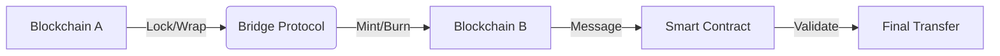

# 🌉 Bridge Guide Lengkap: Panduan Lengkap Cross-Chain Bridge di Crypto 2025

> **"Jembatan digital antar blockchain - kunci untuk ekosistem multi-chain yang terhubung"**

---

## 🎯 Panduan Ini Untuk Siapa?

- **👥 Crypto Traders Indonesia** - Yang mau pindah aset antar blockchain
- **💰 DeFi Users** - Yang butuh optimalisasi yield di berbagai chain
- **🛠️ Developers** - Yang mau implementasi bridge di aplikasi
- **🎓 Investors** - Yang mau paham risiko dan opportunity bridge
- **🔒 Security Conscious** - Yang peduli keamanan saat bridging

---

## 📊 Data Bridge 2025: Market Overview

```python
bridge_market_data_2025 = {
    "total_volume_bridged": "$2.8 triliun",
    "daily_active_users": "1.2 juta",
    "top_bridges_by_tvl": {
        "stargate": "$1.8 miliar",
        "multichain": "$1.2 miliar",
        "hop_protocol": "$800 juta",
        "arbitrum_bridge": "$650 juta",
        "polygon_bridge": "$520 juta"
    },
    "indonesian_usage": {
        "monthly_bridge_volume": "$45 juta",
        "popular_destinations": ["Arbitrum", "Optimism", "Base"],
        "avg_bridge_size": "$1,200"
    }
}
```

---

## 🔍 Fundamental Bridge: Apa Itu Crypto Bridge?

### 💡 Konsep Dasar
**Crypto Bridge** = Jembatan digital yang memungkinkan transfer aset dan data antara blockchain yang berbeda.

### 🏗️ Cara Kerja Bridge


### 📋 Jenis-Jenis Bridge

#### 1. **Trust-Based Bridges (Centralized)**
- **Cara kerja**: Custodian hold aset di chain asal
- **Contoh**: Binance Bridge, Coinbase Bridge
- **Kecepatan**: Cepat (menit)
- **Risiko**: Counterparty risk, KYC required

#### 2. **Trust-Minimized Bridges (Decentralized)**
- **Cara kerja**: Smart contracts + validators
- **Contoh**: Hop Protocol, Connext
- **Kecepatan**: Sedang (15-30 menit)
- **Risiko**: Smart contract risk, validator collusion

#### 3. **Native Bridges**
- **Cara kerja**: Bridge resmi dari blockchain
- **Contoh**: Arbitrum Bridge, Optimism Bridge
- **Kecepatan**: Bervariasi (7 hari untuk withdrawals)
- **Risiko**: Technical complexity

#### 4. **Liquidity Network Bridges**
- **Cara kerja**: AMM-based bridging
- **Contoh**: Stargate Finance, Synapse
- **Kecepatan**: Instan
- **Risiko**: Impermanent loss, liquidity risk

---

## 🏆 Top Bridges 2025: Komparasi Lengkap

### 📈 Bridge Comparison Matrix

| Bridge | Type | Speed | Fees | Security | TVL | Best For |
|--------|------|-------|------|----------|-----|-----------|
| **Stargate** | Liquidity Network | Instant | $5-20 | High | $1.8B | Stablecoins |
| **Multichain** | Trust-Minimized | 15-30 min | $3-15 | Medium | $1.2B | Multi-chain |
| **Hop Protocol** | Hop Network | 15-45 min | $8-25 | High | $800M | ETH/L2 |
| **Arbitrum Bridge** | Native | 7-10 min | $2-8 | High | $650M | L2 transfers |
| **Polygon Bridge** | Native | 10-15 min | $1-5 | High | $520M | EVM chains |
| **Synapse** | Liquidity Network | Instant | $10-30 | High | $450M | Cross-chain AMM |
| **Connext** | Trust-Minimized | 2-10 min | $5-15 | High | $380M | General purpose |

### 🎯 Best Bridge untuk Use Case Spesifik

#### **Untuk Stablecoins (USDC, USDT)**
```python
stablecoin_bridge_recommendations = {
    "high_volume": "Stargate Finance",
    "lowest_fees": "Arbitrum Bridge (untuk L2)",
    "fastest": "Stargate/Synapse",
    "most_secure": "Native Bridges"
}
```

#### **Untuk Ethereum & L2 Transfers**
```python
ethereum_l2_bridges = {
    "ethereum_to_arbitrum": "Arbitrum Native Bridge",
    "ethereum_to_optimism": "Optimism Native Bridge",
    "ethereum_to_polygon": "Polygon POS Bridge",
    "l2_to_l2": "Hop Protocol / Stargate"
}
```

#### **Untuk NFT & Gaming Assets**
```python
nft_bridge_recommendations = {
    "general_nft": "LayerZero",
    "gaming_assets": "Immutable X Bridge",
    "cross_chain_nft": "Synapse NFT Bridge"
}
```

---

## 🛡️ Bridge Security: Panduan Keamanan Lengkap

### ⚠️ Risiko-Risiko Utama Bridge

#### 1. **Smart Contract Risk**
```python
smart_contract_risks = {
    "code_vulnerabilities": [
        "Reentrancy attacks",
        "Overflow/underflow bugs",
        "Logic errors in validation"
    ],
    "mitigation_strategies": [
        "Audit terbaru dari reputable firms",
        "Bug bounty programs aktif",
        "Time-tested contracts (>1 tahun)"
    ]
}
```

#### 2. **Validator/Oracle Risk**
```python
validator_risks = {
    "centralization_risk": "Terlalu sedikit validator",
    "byzantine_faults": "Validator bertindak jahat",
    "oracle_manipulation": "Price feed manipulation",
    "protection": "Distributed validator sets"
}
```

#### 3. **Liquidity Risk**
```python
liquidity_risks = {
    "insufficient_liquidity": "Bridge tidak bisa handle large transfers",
    "impermanent_loss": "Untuk liquidity provider bridges",
    "withdrawal_delays": "Liquidity crunch saat market stress"
}
```

#### 4. **Front-End & Social Engineering**
```python
frontend_risks = {
    "fake_websites": "Phishing sites mirip asli",
    "malicious_extensions": "Browser wallet hijackers",
    "social_engineering": "Discord/Telegram scams"
}
```

### 🔒 Best Practices Keamanan Bridge

#### **Sebelum Bridging**
```python
pre_bridge_security_checklist = [
    "✅ Verifikasi URL official bridge",
    "✅ Check smart contract audit status",
    "✅ Review recent bridge activity volume",
    "✅ Test dengan small amount dulu",
    "✅ Verify gas fees di destination chain",
    "✅ Backup wallet dan recovery phrase"
]
```

#### **Saat Bridging**
```python
during_bridge_best_practices = [
    "🔒 Gunakan hardware wallet (Ledger/Trezor)",
    "📱 Double-check destination address",
    "💰 Hitung total cost (fees + slippage)",
    "⏱️ Pilih transfer speed yang tepat",
    "🔍 Monitor transaksi di block explorers",
    "📸 Screenshots transaksi untuk documentation"
]
```

#### **Setelah Bridging**
```python
post_bridge_verification = [
    "✅ Konfirmasi transaksi sukses di source chain",
    "✅ Tunggu konfirmasi di destination chain",
    "✅ Verify saldo di destination wallet",
    "✅ Check gas balance di destination",
    "✅ Monitor untuk unusual activity",
    "📝 Catat transaksi untuk tax purposes"
]
```

---

## 🚀 Tutorial Praktis: Bridging dengan Stargate Finance

### 📋 Persiapan Awal
```python
bridge_setup_requirements = {
    "wallet": "MetaMask / Trust Wallet / Ledger",
    "source_funds": "ETH di Ethereum mainnet",
    "gas_ethereum": "0.05 ETH untuk fees",
    "destination": "Arbitrum One",
    "target_amount": "1000 USDC"
}
```

### 🎯 Step-by-Step Bridging

#### **Langkah 1: Connect Wallet**
1. Buka [app.stargate.finance](https://app.stargate.finance)
2. Click "Connect Wallet"
3. Pilih wallet (MetaMask recommended)
4. Approve connection

#### **Langkah 2: Pilih Route**
```python
bridge_route_setup = {
    "from_chain": "Ethereum",
    "to_chain": "Arbitrum",
    "from_token": "USDC",
    "to_token": "USDC",
    "amount": "1000"
}
```

#### **Langkah 3: Approve Token**
1. Click "Approve USDC"
2. Confirm di MetaMask
3. Tunggu approval transaction (30-60 detik)

#### **Langkah 4: Execute Bridge**
1. Masukkan jumlah (1000 USDC)
2. Review estimated fees
3. Click "Transfer"
4. Confirm di MetaMask

#### **Langkah 5: Monitor Transfer**
```python
transfer_monitoring = {
    "step_1": "Check Ethereum transaction",
    "step_2": "Tunggu Stargate validation (2-5 menit)",
    "step_3": "Monitor Arbitrum credit",
    "step_4": "Verify USDC balance di Arbitrum"
}
```

### 📊 Biaya-Biaya Bridging (Contoh 1000 USDC)
```python
bridge_cost_breakdown = {
    "ethereum_gas": "$12.50",
    "stargate_fee": "$5.00",
    "destination_gas": "$0.50",
    "total_cost": "$18.00",
    "effective_rate": "98.2% efficiency"
}
```

---

## 💰 Optimasi Biaya Bridge: Tips & Strategi

### ⏰ Timing Optimization
```python
optimal_bridge_timing = {
    "low_gas_periods": [
        "Weekend (Sabtu-Minggu)",
        "Asian timezone hours (08:00-14:00 WIB)",
        "Low volatility market conditions"
    ],
    "high_gas_periods": [
        "Weekday US hours (20:00-02:00 WIB)",
        "Major market announcements",
        "High volatility periods"
    ]
}
```

### 💡 Cost-Saving Strategies

#### **1. Batch Transfers**
```python
batch_transfer_strategy = {
    "concept": "Bridge sekali banyak daripada berkali-kali",
    "optimal_batch_size": "$5,000 - $20,000",
    "savings": "30-50% vs multiple small transfers"
}
```

#### **2. Token Selection**
```python
token_optimization = {
    "low_fee_tokens": ["USDC", "USDT", "DAI"],
    "high_fee_tokens": ["ETH", "WBTC"],
    "recommendation": "Bridge stablecoins, convert di destination"
}
```

#### **3. Layer 2 Routing**
```python
l2_routing_strategy = {
    "expensive_route": "Ethereum → Arbitrum",
    "cheaper_route": "Ethereum → Polygon → Arbitrum",
    "savings": "40-60% dengan intermediate hops"
}
```

---

## 🎯 Advanced Bridge Strategies

### 🔄 Cross-Chain Yield Farming
```python
cross_chain_yield_strategy = {
    "strategy": "Bridge ke chain dengan yield tertinggi",
    "example": "USDC Ethereum → Arbitrum → GMX farming",
    "considerations": [
        "Bridge costs vs yield differential",
        "Impermanent loss risk",
        "Liquidity depth"
    ],
    "tools_for_analysis": [
        "DeFi Llama",
        "Yield optimizers (Yearn, Rook)",
        "Bridge fee calculators"
    ]
}
```

### 🎮 Gaming & NFT Bridge
```python
gaming_bridge_strategy = {
    "use_case": "Pindah gaming assets antar chain",
    "popular_bridges": [
        "LayerZero (general purpose)",
        "Immutable X (gaming specific)",
        "Ronin Bridge (Axie Infinity)"
    ],
    "considerations": [
        "NFT compatibility",
        "Gas fees di gaming chain",
        "Bridge speed untuk gameplay"
    ]
}
```

### 🏢 Institutional Bridging
```python
institutional_bridge_practices = {
    "compliance_requirements": [
        "KYC/AML procedures",
        "Transaction monitoring",
        "Regulatory reporting"
    ],
    "security_measures": [
        "Multi-signature approvals",
        "Hardware security modules (HSMs)",
        "Timelock withdrawals"
    ],
    "preferred_bridges": [
        "WBTC bridge (for Bitcoin)",
        "Circle CCTP (for USDC)",
        "Bank-owned bridges"
    ]
}
```

---

## 📱 Mobile Bridge Tutorial (Trust Wallet)

### 📋 Setup Trust Wallet untuk Bridge
```python
trust_wallet_bridge_setup = {
    "required_networks": [
        "Ethereum Mainnet",
        "BSC Smart Chain",
        "Polygon POS",
        "Arbitrum One"
    ],
    "setup_steps": [
        "Install Trust Wallet",
        "Add networks manually",
        "Backup recovery phrase SECURELY",
        "Fund with ETH/BNB for gas"
    ]
}
```

### 🎯 Mobile Bridge Step-by-Step
```python
mobile_bridge_process = {
    "step_1": "Buka Trust Wallet DApp browser",
    "step_2": "Navigate ke bridge app (Stargate, Multichain)",
    "step_3": "Connect wallet",
    "step_4": "Select source/destination chains",
    "step_5": "Enter amount and confirm",
    "step_6": "Approve semua transactions"
}
```

---

## 🔍 Troubleshooting Bridge Issues

### ⚠️ Common Problems & Solutions

#### **1. Transaction Stuck**
```python
stuck_transaction_solutions = [
    "Check gas price - mungkin terlalu rendah",
    "Wait untuk network congestion",
    "Use accelerate/replace transaction",
    "Contact bridge support jika >24 jam"
]
```

#### **2. Funds Not Arrived**
```python
missing_funds_checklist = [
    "Check destination wallet address",
    "Verify transaction confirmed on source",
    "Wait untuk bridge processing time",
    "Check destination chain gas balance",
    "Monitor bridge status page"
]
```

#### **3. High Slippage**
```python
slippage_reduction_strategies = [
    "Bridge saat low volatility",
    "Use larger amounts to minimize % impact",
    "Compare multiple bridges",
    "Consider alternative routing"
]
```

---

## 🇮🇩 Bridge untuk Pengguna Indonesia

### 💡 Bridge Populer di Indonesia
```python
indonesian_bridge_usage = {
    "most_popular": "Stargate Finance",
    "most_trusted": "Arbitrum Native Bridge",
    "lowest_barrier": "Polygon Bridge",
    "growing_fast": "Base Bridge"
}
```

### 💸 Local Considerations
```python
indonesian_bridge_factors = {
    "regulatory_status": "Legal untuk crypto-to-crypto transfers",
    "tax_implications": "Bridge transactions taxable events",
    "banking_integration": "P2P untuk fiat on/off ramp",
    "community_trust": "Reputasi bridge di local communities"
}
```

### 🏢 Indonesian Exchange Bridge Options
```python
local_exchange_bridges = {
    "indodax": "Limited bridge options",
    "tokocrypto": "Binance bridge integration",
    "pintu": "Basic cross-chain support",
    "rekomendasi": "Gunakan DEX bridges + local exchanges"
}
```

---

## 📈 Bridge Analytics & Monitoring

### 📊 Important Metrics to Track
```python
bridge_metrics = {
    "volume": "24h/7d/30d bridge volume",
    "tvl": "Total value locked di bridge",
    "fees": "Average bridge fees",
    "success_rate": "Transaction success rate",
    "processing_time": "Average completion time"
}
```

### 🔍 Best Tools for Bridge Analysis
```python
bridge_analytics_tools = [
    "Dune Analytics (custom dashboards)",
    "DeFi Llama (bridge rankings)",
    "L2Beat (L2-specific bridges)",
    "Token Terminal (financial metrics)",
    "Bridge-specific dashboards"
]
```

---

## 🚀 Future of Bridge Technology

### 🔮 Trends 2025-2026
```python
bridge_future_trends = {
    "cross_chain_messaging": "Arbitrary messaging beyond value transfer",
    "intent_based_architecture": "Solve MEV dan front-running",
    "modular_bridges": "Composable bridge components",
    "zk_bridge_tech": "Zero-knowledge bridge proofs",
    "regulatory_compliance": "Built-in compliance layers"
}
```

### 🎯 Emerging Bridge Protocols
```python
next_gen_bridges = [
    "LayerZero (omnichain)",
    "Wormhole (cross-chain messaging)",
    "Axelar (programmable interop)",
    "Hyperlane (permissionless messaging)"
]
```

---

## 🎓 Kesimpulan: Bridge Mastery 2025

### 💡 Key Takeaways
1. **Bridge adalah essential tool** untuk multi-chain crypto ecosystem
2. **Security harus priority #1** - selalu verify dan test dengan kecil dulu
3. **Cost optimization possible** dengan timing dan strategy yang tepat
4. **Each bridge punya strength berbeda** - pilih sesuai use case
5. **Indonesian users punya specific considerations** untuk compliance dan access

### 🎯 Action Plan
```python
bridge_mastery_action_plan = [
    "📚 Pelajari 2-3 top bridges secara mendalam",
    "🔒 Setup hardware wallet untuk maximum security",
    "💰 Practice dengan small amounts dulu",
    "📊 Develop personal bridge strategy",
    "🌐 Join bridge communities untuk updates",
    "📈 Monitor bridge performance dan metrics"
]
```

---

## 🔗 Useful Links & Resources

### 🌐 Official Bridge Sites
- [Stargate Finance](https://stargate.finance)
- [Hop Protocol](https://hop.exchange)
- [Arbitrum Bridge](https://bridge.arbitrum.io)
- [Connext](https://connext.network)

### 📊 Analytics & Monitoring
- [Dune Analytics](https://duneanalytics.com)
- [DeFi Llama](https://defillama.com/bridges)
- [L2Beat](https://l2beat.com)
- [Token Terminal](https://tokenterminal.com)

### 🛡️ Security Resources
- [Rekt News](https://rekt.news) - Bridge hacks database
- [Smart Contract Audits](https://github.com/ConsenSys/awesome-blockchain-security)
- [Bridge Security Checklist](https://github.com/ethereum-lists/bridges)

### 🇮🇩 Indonesian Communities
- [Crypto Indonesia Telegram](https://t.me/cryptoindonesia)
- [DeFi Indonesia Discord](https://discord.gg/defi-indonesia)
- [Blockchain Indonesia Forum](https://blockchain-id.org)

---

> 🌉 **"Bridge bukan cuma tool teknis - ini adalah jembatan masa depan financial system. Pahami, gunakan dengan bijak, dan manfaatkan peluang multi-chain ecosystem."**

---

*Updated: September 2025 | Crypto Bridge Guide for Indonesian Users | Part of Complete Financial Markets Knowledge Base*