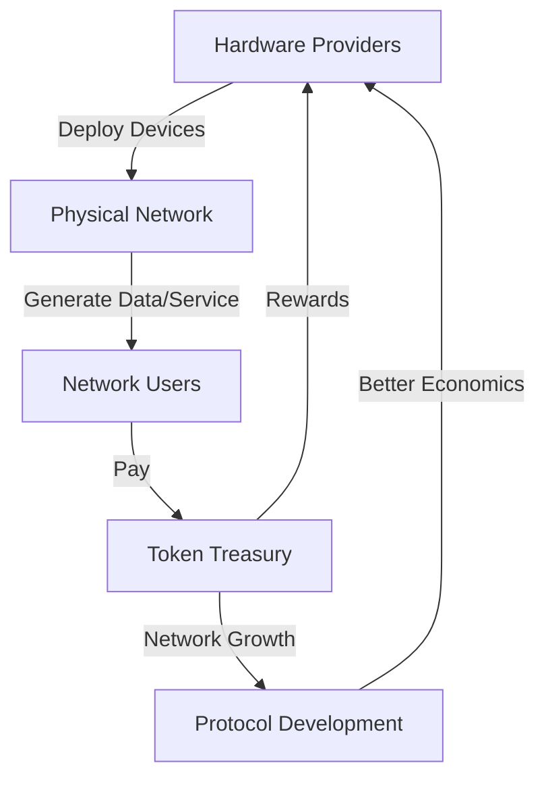

# 🌱 DePIN Guide Lengkap: Decentralized Physical Infrastructure Networks 2025

> **"Infrastruktur fisik yang dimiliki komunitas - revolusi cara kita membangun jaringan global"**

---

## 🎯 Panduan Ini Untuk Siapa?

- **👥 Crypto Investors Indonesia** - Yang mau investasi di DePIN projects
- **🛠️ Tech Enthusiasts** - Yang mau ikut kontribusi hardware/network
- **💰 Hardware Owners** - Yang mau monetize device dan bandwidth
- **🏢 Enterprise Users** - Yang mau pake DePIN services
- **🎓 Blockchain Developers** - Yang mau bangun di DePIN networks
- **🔍 Researchers** - Yang mau analisis token economics dan growth

---

## 📊 Data DePIN 2025: Market Overview

```python
depin_market_data_2025 = {
    "total_market_cap": "$45.2 miliar",
    "annual_growth": "525% YoY",
    "devices_connected": "3.8 juta",
    "monthly_revenue": "$287 juta",
    "major_sectors": {
        "wireless_networks": "$12.1 miliar",
        "decentralized_storage": "$10.8 miliar",
        "compute_networks": "$9.4 miliar",
        "energy_networks": "$6.2 miliar",
        "mapping_sensors": "$4.7 miliar"
    },
    "indonesian_market": {
        "active_contributors": "45,000+",
        "hardware_invested": "$28 juta",
        "monthly_earnings": "$1.2 juta",
        "growth_rate": "180% YoY"
    }
}
```

---

## 🔍 Fundamental DePIN: Apa Itu Physical Infrastructure Networks?

### 💡 Konsep Dasar
**DePIN (Decentralized Physical Infrastructure Networks)** = Jaringan infrastruktur fisik yang dibangun dan dioperasikan oleh komunitas menggunakan blockchain untuk insentif dan koordinasi.

### 🏗️ Cara Kerja DePIN


### 📋 Komponen Utama DePIN

#### 1. **Physical Layer**
```python
physical_layer_components = {
    "hardware_devices": [
        "Wireless hotspots (Helium)",
        "Storage nodes (Filecoin, Arweave)",
        "GPU servers (Render)",
        "Solar panels + inverters (Energy Web)",
        "GPS sensors (Hivemapper)"
    ],
    "infrastructure_requirements": [
        "Physical space",
        "Power supply",
        "Internet connectivity",
        "Maintenance",
        "Weather protection"
    ]
}
```

#### 2. **Network Layer**
```python
network_layer_protocols = {
    "communication_protocols": [
        "Wireless protocols (LoRaWAN, WiFi 6)",
        "Storage protocols (IPFS, Filecoin)",
        "Compute protocols (GPU rendering, AI inference)",
        "Energy trading protocols"
    ],
    "network_topology": [
        "Mesh networks",
        "Peer-to-peer networks",
        "Hybrid centralized-decentralized"
    ]
}
```

#### 3. **Blockchain Layer**
```python
blockchain_integration = {
    "smart_contracts": [
        "Token minting/burning",
        "Service level agreements",
        "Reputation systems",
        "Governance voting"
    ],
    "token_economics": [
        "Supply mechanisms",
        "Demand drivers",
        "Token utility",
        "Staking requirements"
    ]
}
```

---

## 🏆 Major DePIN Categories 2025

### 📱 1. Wireless Networks

#### **Helium Network (HNT)**
```python
helium_network_2025 = {
    "market_cap": "$3.2 miliar",
    "hotspots_deployed": "850,000+",
    "coverage_countries": "180+",
    "token_price": "$8.45",
    "monthly_earnings_avg": "$45-120 per hotspot",
    "indonesian_stats": {
        "hotspots": "12,500+",
        "cities_covered": "45+",
        "avg_monthly_earnings": "$38-85"
    }
}
```

**Cara Kerja Helium:**
- **Hotspot owners** deploy LoRaWAN devices
- **IoT devices** pay HNT untuk network access
- **Proof-of-Coverage** validates hotspot locations
- **HNT rewards** untuk providing coverage

#### **Pollen Mobile & Competitors**
```python
wireless_depin_competitors = {
    "pollen_mobile": {
        "focus": "5G-compatible mobile network",
        "innovation": "PCAP (Proof of Coverage Architecture Protocol)",
        "market_cap": "$450 juta"
    },
    "nexera": {
        "focus": "Enterprise wireless solutions",
        "innovation": "Hybrid 4G/5G networks",
        "market_cap": "$280 juta"
    }
}
```

### 💾 2. Decentralized Storage

#### **Filecoin (FIL)**
```python
filecoin_network_2025 = {
    "market_cap": "$4.8 miliar",
    "storage_capacity": "18.7 exabytes",
    "active_storers": "3,200+",
    "storage_cost": "$0.002 per GB/month",
    "token_price": "$7.82",
    "rewards_structure": {
        "base_rewards": "Storage provision",
        "block_rewards": "Mining participation",
        "deal_rewards": "Active storage contracts"
    }
}
```

#### **Arweave (AR)**
```python
arweave_permanent_storage = {
    "market_cap": "$1.2 miliar",
    "data_permanent": "200+ years guaranteed",
    "storage_cost": "One-time fee untuk permanence",
    "token_burn_mechanics": "Storage fees memburn AR tokens",
    "use_cases": [
        "Permanent web hosting",
        "NFT metadata storage",
        "Archival data",
        "Academic research"
    ]
}
```

#### **Storage Network Comparison**
| Network | Cost Model | Duration | Speed | Best For |
|---------|------------|----------|-------|-----------|
| **Filecoin** | Monthly fee | Flexible | Fast | Active data |
| **Arweave** | One-time fee | Permanent | Medium | Archives |
| **Sia** | Competitive | Flexible | Fast | Cost-sensitive |
| **Storj** | Pay-per-use | Flexible | Fast | Enterprise |

### 🖥️ 3. Compute Networks

#### **Render Network (RNDR)**
```python
render_network_2025 = {
    "market_cap": "$3.8 miliar",
    "gpu_providers": "120,000+",
    "monthly_render_jobs": "450,000+",
    "token_price": "$12.30",
    "gpu_earnings": {
        "entry_level": "$100-300/month",
        "mid_range": "$300-800/month",
        "high_end": "$800-2500/month"
    },
    "ai_integration": "75% growth in AI inference jobs"
}
```

#### **Akash Network (AKT)**
```python
akash_cloud_computing = {
    "market_cap": "$850 juta",
    "total_compute": "120,000+ CPU cores",
    "providers": "450+",
    "cost_savings": "60-80% vs traditional cloud",
    "workloads": [
        "Web hosting",
        "Blockchain nodes",
        "AI training",
        "Data processing"
    ]
}
```

### ⚡ 4. Energy Networks

#### **Powerledger (POWR)**
```python
powerledger_energy_trading = {
    "market_cap": "$620 juta",
    "active_markets": ["Australia", "Thailand", "Germany"],
    "energy_traded": "450 GWh monthly",
    "participants": "85,000+",
    "token_utility": "Energy market access fees"
}
```

#### **Energy Web Chain (EWT)**
```python
energy_web_blockchain = {
    "focus": "Energy sector blockchain",
    "market_cap": "$480 juta",
    "enterprise_partners": "50+ utilities",
    "carbon_credits_tracked": "12M+ tons",
    "use_cases": [
        "Renewable energy certificates",
        "Grid optimization",
        "Electric vehicle charging",
        "Smart metering"
    ]
}
```

### 🗺️ 5. Mapping & Sensor Networks

#### **Hivemapper (HONEY)**
```python
hivemapper_decentralized_mapping = {
    "market_cap": "$380 juta",
    "active_mappers": "125,000+",
    "km_mapped": "85M+ km",
    "data_coverage": "120+ countries",
    "earnings_model": "$0.10-0.50 per km mapped",
    "indonesian_mappers": "8,500+"
}
```

#### **DIMO (Vehicle Data Network)**
```python
dimo_vehicle_data = {
    "market_cap": "$290 juta",
    "connected_vehicles": "180,000+",
    "data_points_collected": "2.1B+ daily",
    "monetization": "Auto insurance, fleet management, research"
}
```

---

## 💰 DePIN Token Economics: Bagaimana Mereka Menghasilkan Uang?

### 📊 Token Economics Framework
```python
depin_token_economics = {
    "supply_side_incentives": [
        "Token rewards untuk hardware deployment",
        "Network usage fees sharing",
        "Governance participation rewards",
        "Liquidity mining programs"
    ],
    "demand_side_drivers": [
        "Service payments (storage, compute, bandwidth)",
        "Network access fees",
        "Premium features",
        "Enterprise subscriptions"
    ],
    "token_utility": [
        "Network currency",
        "Governance voting",
        "Staking requirements",
        "Protocol access"
    ]
}
```

### 💵 Revenue Models DePIN

#### 1. **Network Usage Fees**
```python
usage_fee_model = {
    "storage_networks": "Per GB per month",
    "compute_networks": "Per GPU hour",
    "wireless_networks": "Per data packet",
    "energy_networks": "Per kWh traded",
    "mapping_networks": "Per km mapped"
}
```

#### 2. **Hardware Sales & Leasing**
```python
hardware_monetization = {
    "direct_sales": "Manufacturer to miner",
    "leasing_programs": "Hardware-as-a-Service",
    "staking_requirements": "Device NFTs or tokens",
    "financing_options": "DeFi for hardware loans"
}
```

#### 3. **Enterprise Solutions**
```python
enterprise_revenue_streams = {
    "white_label_solutions": "Custom DePIN deployments",
        "api_access": "Data and network access",
        "consulting": "Implementation services",
        "maintenance": "Network management"
}
```

---

## 🛠️ Cara Berpartisipasi di DePIN Networks

### 📱 Getting Started dengan Helium (Wireless)

#### **Persyaratan Hardware**
```python
helium_hardware_requirements = {
    "hotspot_options": [
        "Rak Miner V2 - $350-450",
        "Bobcat Miner 300 - $400-500",
        "Sensecap M1 - $250-350",
        "DIY setup (advanced) - $150-300"
    ],
    "additional_costs": [
        "Outdoor antenna - $50-150",
        "Ethernet cable - $10-30",
        "PoE injector - $20-40",
        "Mounting hardware - $20-50"
    ]
}
```

#### **Setup Tutorial Helium**
```python
helium_setup_steps = [
    "1. Pilih lokasi yang baik (elevated, clear view)",
    "2. Pasang antenna outdoor dengan line of sight yang baik",
    "3. Connect hotspot ke internet via Ethernet",
    "4. Power on device dan tunggu boot (5-10 menit)",
    "5. Add hotspot ke Helium app",
    "6. Confirm location dan aktifkan",
    "7. Monitor earnings di mobile app"
]
```

#### **Expected Earnings (Indonesia)**
```python
helium_earnings_projection = {
    "urban_area": {
        "hotspot_density": "Tinggi",
        "daily_earnings": "$0.80-2.50",
        "monthly_earnings": "$24-75",
        "roi_timeline": "8-15 bulan"
    },
    "rural_area": {
        "hotspot_density": "Rendah",
        "daily_earnings": "$2.00-5.00",
        "monthly_earnings": "$60-150",
        "roi_timeline": "5-10 bulan"
    }
}
```

### 💾 Getting Started dengan Filecoin (Storage)

#### **Persyaratan System**
```python
filecoin_hardware_requirements = {
    "minimum_specs": {
        "cpu": "8 cores",
        "ram": "32GB DDR4",
        "storage": "8TB+ NVMe SSD",
        "gpu": "Tidak required tapi recommended",
        "internet": "100 Mbps+ upload"
    },
    "recommended_specs": {
        "cpu": "16+ cores",
        "ram": "64GB+ DDR4",
        "storage": "16TB+ NVMe",
        "gpu": "RTX 3060+",
        "internet": "1 Gbps+"
    }
}
```

#### **Setup Process Filecoin**
```python
filecoin_setup_process = [
    "1. Build atau buy storage node",
    "2. Install Lotus client",
    "3. Sync blockchain (1-3 hari)",
    "4. Join storage market",
    "5. Configure storage parameters",
    "6. Start sealing sectors",
    "7. Accept storage deals"
]
```

### 🖥️ Getting Started dengan Render (Compute)

#### **GPU Requirements**
```python
render_gpu_requirements = {
    "minimum_viable": {
        "gpu": "RTX 2060 Super / Radeon RX 5600 XT",
        "vram": "8GB+",
        "power_supply": "650W+ 80+ Gold",
        "monthly_earnings": "$50-120"
    },
    "recommended": {
        "gpu": "RTX 3090 / RTX 4090",
        "vram": "24GB+",
        "power_supply": "1000W+ 80+ Platinum",
        "monthly_earnings": "$200-600"
    },
    "enterprise": {
        "gpu": "Multiple RTX 4090s / A100s",
        "vram": "48GB+ per GPU",
        "power_supply": "2000W+ redundant",
        "monthly_earnings": "$1000-5000+"
    }
}
```

---

## 📈 DePIN Investment Strategies

### 💎 Long-term Investment Thesis
```python
depin_investment_thesis = {
    "market_opportunity": "$500T+ global infrastructure market",
    "disruption_potential": "60-90% cost reduction vs traditional",
    "growth_catalysts": [
        "AI boom requiring massive compute",
        "Data explosion needing storage",
        "IoT expansion requiring connectivity",
        "Energy transition requiring smart grids"
    ],
    "competitive_advantages": [
        "Lower costs through community ownership",
        "Better coverage through distributed deployment",
        "Faster innovation through open protocols",
        "Reduced single points of failure"
    ]
}
```

### 🎯 Investment Strategies by Risk Profile

#### **Conservative Strategy**
```python
conservative_depin_investing = {
    "focus": "Established projects with real usage",
    "top_picks": ["HNT", "FIL", "RNDR", "AR"],
    "allocation": "5-10% of crypto portfolio",
    "time_horizon": "3-5+ years",
    "risk_management": "Dollar-cost averaging, stop losses"
}
```

#### **Growth Strategy**
```python
growth_depin_investing = {
    "focus": "Mid-cap projects with strong traction",
    "picks": ["AKT", "POWR", "HONEY", "EWT"],
    "allocation": "10-20% of crypto portfolio",
    "time_horizon": "1-3 years",
    "strategy": "Buy dips, monitor metrics"
}
```

#### **Speculative Strategy**
```python
speculative_depin_investing = {
    "focus": "Early-stage projects with high potential",
    "research_areas": [
        "DePIN launchpads",
        "Hardware tokenization",
        "DePIN-focused VCs portfolio"
    ],
    "allocation": "1-5% of crypto portfolio",
    "time_horizon": "6-18 months",
    "high_risk": "Many projects will fail"
}
```

---

## 🇮🇩 DePIN Opportunities di Indonesia

### 🌏 Why Indonesia is Perfect for DePIN
```python
indonesia_depin_opportunity = {
    "geographic_advantages": [
        "Archipelago geography (17,000+ islands)",
        "Need for decentralized connectivity",
        "High mobile penetration (but poor broadband)",
        "Tropical climate for solar energy"
    ],
    "demographic_factors": [
        "Young, tech-savvy population",
        "Growing crypto adoption",
        "Entrepreneurial culture",
        "Need for affordable infrastructure"
    ],
    "economic_opportunities": [
        "Rural broadband deployment",
        "Urban IoT networks",
        "Renewable energy microgrids",
        "Data centers outside Java"
    ]
}
```

### 🎯 Local DePIN Projects & Communities
```python
indonesian_depin_ecosystem = {
    "helium_community": {
        "groups": "Helium Indonesia (Facebook, Telegram)",
        "hotspots": "12,500+ deployed",
        "focus": "Rural connectivity, urban IoT"
    },
    "filecoin_miners": {
        "community": "Filecoin Indonesia Discord",
        "storage_nodes": "850+",
        "advantage": "Cheap electricity, good internet"
    },
    "render_providers": {
        "community": "Indonesia GPU Miners",
        "gpu_farms": "120+",
        "opportunity": "AI inference demand"
    },
    "energy_projects": {
        "focus": "Solar microgrids",
        "pilot_projects": "15+ locations",
        "potential": "Renewable energy trading"
    }
}
```

### 💼 Business Opportunities
```python
indonesian_depin_business_models = {
    "hardware_import_distribution": [
        "DePIN device importation",
        "Local assembly and support",
        "Installation services"
    ],
    "consulting_services": [
        "DePIN deployment consulting",
        "Network optimization",
        "Token economics advisory"
    ],
    "infrastructure_operations": [
        "Large-scale hotspot deployment",
        "Storage farm operations",
        "GPU render farms"
    ]
}
```

---

## 🛡️ DePIN Risks & Challenges

### ⚠️ Major Risk Factors

#### **1. Technology Risks**
```python
technology_risks = {
    "hardware_obsolescence": "Devices may become outdated",
    "protocol_changes": "Network upgrades may require new hardware",
    "scalability_issues": "Network may not handle growth",
    "security_vulnerabilities": "Smart contract or protocol hacks"
}
```

#### **2. Market Risks**
```python
market_risks = {
    "token_volatility": "Prices can drop 80-90%",
    "competition": "Traditional providers may undercut",
    "regulatory_crackdown": "Governments may restrict",
    "adoption_failure": "Users may not choose DePIN solutions"
}
```

#### **3. Operational Risks**
```python
operational_risks = {
    "hardware_failures": "Devices can break or malfunction",
    "maintenance_costs": "Ongoing expenses may exceed earnings",
    "internet_dependencies": "Require reliable connectivity",
    "power_requirements": "High electricity consumption"
}
```

### 📋 Risk Mitigation Strategies
```python
risk_mitigation_framework = {
    "diversification": "Don't put all resources in one project",
    "gradual_deployment": "Start small, scale based on results",
    "continuous_monitoring": "Track network metrics and earnings",
    "community_engagement": "Join project communities for updates",
    "regulatory_compliance": "Stay informed about local laws"
}
```

---

## 🚀 Future of DePIN: 2025-2030

### 🔮 Emerging Trends
```python
depin_future_trends = {
    "ai_integration": "AI networks akan jadi largest DePIN category",
    "tokenization_real_world_assets": "Physical asset tokenization on DePIN",
    "decentralized_manufacturing": "3D printing networks untuk hardware",
    "space_based_networks": "Satellite constellations dengan DePIN incentives",
    "biometric_networks": "Healthcare data infrastructure"
}
```

### 🎯 Next Big Categories
```python
emerging_depin_categories = [
    "DePIN for Healthcare (medical data, diagnostics)",
    "DePIN for Agriculture (sensors, automation)",
    "DePIN for Transportation (autonomous vehicles, logistics)",
    "DePIN for Education (distributed learning infrastructure)",
    "DePIN for Entertainment (VR/AR infrastructure)"
]
```

---

## 📚 Resources & Tools

### 🔧 Essential Tools for DePIN Participants
```python
depin_tools_and_resources = {
    "monitoring_dashboards": [
        "Helium Explorer",
        "Filecoin Starboard",
        "Render Network Dashboard",
        "DePIN Llama (aggregated metrics)"
    ],
    "hardware_resources": [
        "DePIN Hardware Wiki",
        "MinerBros (reviews)",
        "GPU-Miners (GPU benchmarks)",
        "Solar calculator sites"
    ],
    "community_platforms": [
        "Discord servers for each project",
        "Reddit communities",
        "Telegram groups (Indonesian)",
        "Twitter/X project accounts"
    ]
}
```

### 📊 Important Metrics to Track
```python
depin_kpi_monitoring = {
    "network_growth": "Active devices, users, transactions",
    "token_economics": "Supply, demand, burn rates",
    "revenue_metrics": "Real revenue vs token emissions",
    "competitive_analysis": "Market share vs alternatives",
    "regulatory_developments": "Government stances globally"
}
```

---

## 🎓 Kesimpulan: DePIN Revolution 2025

### 💡 Key Takeaways
1. **DePIN represents fundamental shift** dalam cara kita build infrastructure
2. **Real utility and revenue** beyond pure speculation
3. **Massive market opportunity** ($500T+ global infrastructure)
4. **Indonesia positioned perfectly** untuk DePIN adoption
5. **Multiple ways to participate** - investor, operator, user, developer

### 🎯 Action Plan
```python
depin_action_plan = [
    "📚 Pelajari 1-2 DePIN categories secara mendalam",
    "💰 Start dengan small investment dulu",
    "🛠️ Coba participate sebagai provider (kalau ada hardware)",
    "📊 Monitor network metrics dan growth",
    "🌐 Join DePIN communities untuk updates",
    "🏢 Explore business opportunities di Indonesia"
]
```

---

## 🔗 Useful Links & Resources

### 🌐 Official DePIN Resources
- [DePIN Wiki](https://depins.org)
- [Helium Network](https://helium.com)
- [Filecoin](https://filecoin.io)
- [Render Network](https://renderfoundation.com)
- [DePIN Hub](https://depinhub.io)

### 📊 Analytics & Monitoring
- [DePIN Llama](https://defillama.com/depin)
- [Messari DePIN Research](https://messari.io/category/depin)
- [Dune Analytics DePIN Dashboards](https://duneanalytics.com)
- [Token Terminal Infrastructure](https://tokenterminal.com)

### 🇮🇩 Indonesian Communities
- [DePIN Indonesia Telegram](https://t.me/depinindonesia)
- [Helium Indonesia Facebook Group](https://facebook.com/groups/heliumindonesia)
- [Crypto Indonesia Forum](https://cryptoindonesia.org)
- [Blockchain Indonesia Association](https://aba-indonesia.org)

---

> 🌱 **"DePIN bukan cuma crypto trend - ini adalah masa depan infrastruktur global. Partisipasi sekarang artinya membangun jaringan yang akan kita gunakan untuk decades ke depan."**

---

*Updated: September 2025 | DePIN Guide for Indonesian Users | Part of Complete Financial Markets Knowledge Base*