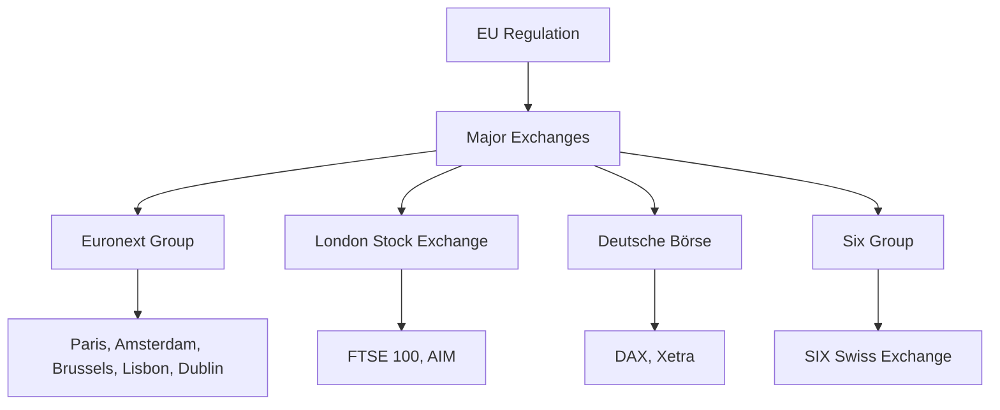

# 🇪🇺 European Stock Markets Guide: Panduan Lengkap Pasar Saham Eropa

> **"Menjelajahi ekosistem pasar modal Eropa - dari London hingga Frankfurt, peluang investasi di benua tertua"**

---

## 🎯 Panduan Ini Untuk Siapa?

- **👥 Investors Indonesia** - Yang mau diversifikasi ke pasar Eropa
- **💼 Portfolio Managers** - Yang mencari exposure ke saham Eropa
- **🎓 Finance Students** - Yang belajar pasar modal global
- **🏢 Corporate Executives** - Yang consider ekspansi ke Eropa
- **📊 Analysts** - Yang butuh pemahaman mendalam pasar Eropa
- **💰 Individual Investors** - Yang mau investasi di blue-chip companies

---

## 📊 Data European Markets 2025: Market Overview

```python
european_markets_data_2025 = {
    "total_market_cap": "$18.5 triliun",
    "daily_volume": "$320 miliar",
    "major_exchanges": {
        "euronext": "$6.8 triliun market cap",
        "london": "$4.2 triliun market cap",
        "frankfurt": "$3.9 triliun market cap",
        "paris": "$3.1 triliun market cap"
    },
    "indonesian_investor_interest": {
        "investor_participation": "12,000+ accounts",
        "monthly_investment": "$45-65 juta",
        "popular_sectors": ["Luxury", "Banking", "Pharmaceuticals", "Automotive"],
        "growth_rate": "35% YoY"
    },
    "key_indices": {
        "euro_stoxx_50": "4,250 points (+8.5% YTD)",
        "ftse_100": "7,890 points (+6.2% YTD)",
        "dax": "18,650 points (+12.3% YTD)",
        "cac_40": "7,320 points (+9.1% YTD)"
    }
}
```

---

## 🔍 Fundamental European Markets: Ekosistem Pasar Modal Eropa

### 💡 Konsep Dasar
**European Stock Markets** = Jaringan bursa efek yang terhubung di seluruh Eropa, masing-masing dengan karakteristik unik namun terintegrasi melalui regulasi dan teknologi.

### 🏗️ Struktur Pasar Eropa


### 📋 Major European Exchanges

#### 1. **Euronext Group**
```python
euronext_characteristics = {
    "markets": ["Paris", "Amsterdam", "Brussels", "Lisbon", "Dublin", "Oslo", "Milan"],
    "market_cap": "$6.8 triliun",
    "listing_requirements": "Stringent EU standards",
    "trading_platforms": "Euronext Optiq, Euronext Block",
    "key_strengths": {
        "diversification": "Pan-European coverage",
        "technology": "Advanced trading infrastructure",
        "regulation": "MiFID II compliant",
        "liquidity": "Deep pools across markets"
    }
}
```

#### 2. **London Stock Exchange (LSE)**
```python
lse_characteristics = {
    "market_cap": "$4.2 triliun",
    "main_markets": ["Main Market", "AIM"],
    "index": "FTSE 100, FTSE 250, FTSE All-Share",
    "advantages": {
        "international": "Global company listings",
        "flexibility": "Multiple market segments",
        "technology": "Turquoise trading platform",
        "access": "Gateway to European markets"
    },
    "post_brexit_status": "Maintains EU access through equivalence"
}
```

#### 3. **Deutsche Börse (Frankfurt)**
```python
deutsche_borse_characteristics = {
    "market_cap": "$3.9 triliun",
    "main_index": "DAX, MDAX, TecDAX, SDAX",
    "trading_system": "Xetra (fully electronic)",
    "specializations": {
        "derivatives": "Eurex (largest derivatives exchange)",
        "clearing": "Eurex Clearing",
        "settlement": "Clearstream Banking",
        "data": "Market data and analytics"
    },
    "strengths": "Technology leader, German corporate focus"
}
```

#### 4. **Six Group (Switzerland)**
```python
six_group_characteristics = {
    "market_cap": "$2.1 triliun",
    "main_exchange": "SIX Swiss Exchange",
    "flagship_index": "SMI (Swiss Market Index)",
    "competitive_advantages": {
        "stability": "Political and economic stability",
        "banking_secrecy": "Financial privacy tradition",
        "currency": "Swiss Franc safe haven",
        "quality": "High disclosure standards"
    }
}
```

---

## 📊 European Market Indices

### 🎯 Major Indices Analysis

#### **Euro Stoxx 50**
```python
euro_stoxx_50_analysis = {
    "description": "50 largest blue-chip companies in Eurozone",
    "composition": "France, Germany, Netherlands, Italy, Spain",
    "weighting": "Market capitalization weighted",
    "performance_2025": {
        "ytd_return": "+8.5%",
        "market_cap": "$4.2 triliun",
        "dividend_yield": "3.2%",
        "p_e_ratio": "15.8x"
    },
    "top_holdings": {
        "lvmh": "6.8% weighting (Luxury)",
        "asml": "5.2% weighting (Semiconductors)",
        "sap": "4.9% weighting (Software)",
        "total": "25% of index weight in top 10"
    }
}
```

#### **FTSE 100 (UK)**
```python
ftse_100_analysis = {
    "description": "100 largest companies listed on LSE",
    "sector_breakdown": {
        "financials": "21%",
        "energy": "15%",
        "consumer_goods": "18%",
        "healthcare": "12%",
        "industrials": "11%"
    },
    "performance_2025": {
        "ytd_return": "+6.2%",
        "dividend_yield": "3.8%",
        "p_e_ratio": "14.2x"
    },
    "global_focus": "70% of revenue from outside UK"
}
```

#### **DAX (Germany)**
```python
dax_analysis = {
    "description": "40 largest companies on Frankfurt Stock Exchange",
    "sector_focus": {
        "automotive": "25% (BMW, Mercedes, Volkswagen)",
        "industrial": "20%",
        "chemicals": "15%",
        "technology": "12%"
    },
    "performance_2025": {
        "ytd_return": "+12.3%",
        "dividend_yield": "2.9%",
        "p_e_ratio": "16.5x"
    },
    "export_orientation": "85% of DAX companies export-focused"
}
```

---

## 🏛️ Regulatory Framework Eropa

### 📋 MiFID II (Markets in Financial Instruments Directive)
```python
mifid_ii_framework = {
    "purpose": "Harmonize financial regulation across EU",
    "key_requirements": {
        "investor_protection": "Enhanced disclosure requirements",
        "transparency": "Pre-trade and post-trade transparency",
        "best_execution": "Mandated for investment firms",
        "reporting": "Comprehensive trade reporting"
    },
    "impact_on_markets": {
        "liquidity": "Fragmented but more transparent",
        "costs": "Increased compliance costs",
        "competition": "More trading venues",
        "technology": "Advanced systems required"
    }
}
```

### 🏢 ESMA (European Securities and Markets Authority)
```python
esma_role = {
    "responsibilities": [
        "Enhancing investor protection",
        "Promoting stable markets",
        "Supervising rating agencies",
        "Coordinating national regulators"
    ],
    "powers": {
        "rule_making": "Technical standards",
        "supervision": "Direct supervision of entities",
        "enforcement": "Sanctions for violations",
        "coordination": "Cross-border cooperation"
    }
}
```

---

## 💼 Sector Analysis European Markets

### 🏭 Key Sectors di Eropa

#### **1. Luxury Goods**
```python
luxury_sector_analysis = {
    "market_size": "$380 miliar",
    "key_players": ["LVMH", "Kering", "Hermès", "Richemont"],
    "growth_drivers": {
        "asian_demand": "45% of luxury sales",
        "brand_strength": "Strong pricing power",
        "digitalization": "E-commerce expansion",
        "sustainability": "ESG premium"
    },
    "investment_characteristics": {
        "margins": "25-35% operating margins",
        "growth": "8-12% annual growth",
        "resilience": "Resistant to economic cycles",
        "competitive_moat": "Brand barriers to entry"
    }
}
```

#### **2. Automotive**
```python
automotive_sector_analysis = {
    "market_size": "$850 miliar",
    "key_players": ["Volkswagen", "BMW", "Mercedes", "Stellantis", "Renault"],
    "transition_challenges": {
        "electric_vehicles": "€500B+ investment needed",
        "supply_chain": "Battery and chip shortages",
        "regulation": "EU Green Deal requirements",
        "competition": "Chinese EV manufacturers"
    },
    "investment_opportunities": {
        "established": "Traditional manufacturers with strong brands",
        "innovation": "EV and autonomous driving leaders",
        "supply_chain": "Battery and component manufacturers",
        "services": "Charging infrastructure and software"
    }
}
```

#### **3. Pharmaceuticals**
```python
pharma_sector_analysis = {
    "market_size": "$320 miliar",
    "key_players": ["Novartis", "Roche", "Sanofi", "AstraZeneca", "Bayer"],
    "growth_drivers": {
        "aging_population": "EU demographic trends",
        "innovation": "Biotechnology and new treatments",
        "generics": "Patent expirations and biosimilars",
        "emerging_markets": "Expansion to Asia and Africa"
    },
    "regulatory_environment": {
        "ema": "European Medicines Agency oversight",
        "pricing": "National healthcare systems",
        "approvals": "Centralized approval process",
        "patents": "Strong IP protection"
    }
}
```

#### **4. Banking & Financial Services**
```python
banking_sector_analysis = {
    "market_size": "$2.1 triliun",
    "key_players": ["HSBC", "BNP Paribas", "Santander", "ING", "UBS"],
    "challenges": {
        "interest_rates": "Net interest margin pressure",
        "digitalization": "Competition from fintechs",
        "regulation": "Capital requirements and compliance",
        "consolidation": "Industry consolidation trends"
    },
    "investment_themes": {
        "digital_banks": "Online-first banking platforms",
        "wealth_management": "Growing HNW population",
        "sustainable_finance": "ESG and green banking",
        "cross_border": "Pan-European banking integration"
    }
}
```

---

## 🇮🇩 Akses Pasar Eropa untuk Investor Indonesia

### 💸 Cara Berinvestasi di Pasar Eropa

#### **1. Melalui Broker Internasional**
```python
international_broker_access = {
    "popular_brokers": [
        "Interactive Brokers",
        "Saxo Bank",
        "Charles Schwab International",
        "TD Direct Investing"
    ],
    "requirements": {
        "minimum_account": "$10,000-25,000",
        "documentation": "Passport, proof of address, tax ID",
        "compliance": "FATCA reporting requirements",
        "fees": "Commission + currency conversion fees"
    },
    "advantages": [
        "Direct market access",
        "Full product range",
        "Professional platforms",
        "Research and analytics"
    ]
}
```

#### **2. Melalui ETF dan Funds**
```python
etf_investment_options = {
    "european_broad_market": [
        "iShares MSCI EMU ETF (EZU)",
        "Vanguard FTSE Europe ETF (VGK)",
        "SPDR Euro Stoxx 50 ETF (FEZ)"
    ],
    "country_specific": [
        "iShares MSCI Germany ETF (EWG)",
        "iShares MSCI UK ETF (EWU)",
        "iShares MSCI France ETF (EWQ)"
    ],
    "sector_specific": [
        "iShares Global Healthcare ETF (IXJ)",
        "iShares Global Automotive ETF (CARZ)",
        "iShares Global Luxury Goods ETF (GXLU)"
    ],
    "advantages": {
        "accessibility": "Available through Indonesian brokers",
        "diversification": "Instant diversification",
        "liquidity": "High trading volumes",
        "cost_effective": "Lower fees than direct investment"
    }
}
```

#### **3. Melalui Indonesian Broker Partnerships**
```python
local_broker_european_access = {
    "available_platforms": [
        "Mandiri Sekuritas - International Trading",
        "BNI Sekuritas - Global Markets",
        "Danareksa - Overseas Investment"
    ],
    "products": {
        "blue_chip_adrs": "European companies with US listings",
        "etf_access": "European market ETFs",
        "mutual_funds": "European equity funds",
        "structured_products": "Capital protected notes"
    },
    "advantages": {
        "local_support": "Bahasa Indonesia service",
        "regulatory_protection": "OJK oversight",
        "tax_simplicity": "Local tax reporting",
        "accessibility": "Lower minimum investments"
    }
}
```

---

## 📈 Strategi Investasi untuk Pasar Eropa

### 🎯 Investment Strategies

#### **1. Blue-Chip Dividend Strategy**
```python
blue_chip_strategy = {
    "objective": "Stable income with capital preservation",
    "criteria": {
        "market_cap": ">€10 miliar",
        "dividend_yield": ">3%",
        "payout_ratio": "<60%",
        "debt_to_equity": "<1.0x"
    },
    "sectors": "Utilities, Consumer Staples, Healthcare",
    "examples": [
        "Nestlé (Switzerland)",
        "Roche (Switzerland)",
        "Unilever (UK)",
        "Novartis (Switzerland)"
    ],
    "risk_profile": "Low to Medium",
    "expected_return": "6-8% annually"
}
```

#### **2. Growth Technology Strategy**
```python
tech_growth_strategy = {
    "objective": "Capital appreciation through technology exposure",
    "focus": "Semiconductors, Software, Clean Tech",
    "criteria": {
        "revenue_growth": ">15% annually",
        "r_and_d": ">10% of revenue",
        "gross_margin": ">50%",
        "cash_position": "Strong balance sheet"
    },
    "examples": [
        "ASML (Netherlands)",
        "SAP (Germany)",
        "Dassault Systèmes (France)",
        "Infineon (Germany)"
    ],
    "risk_profile": "High",
    "expected_return": "12-18% annually"
}
```

#### **3. Value Investing Strategy**
```python
value_investing_strategy = {
    "objective": "Undervalued companies with turnaround potential",
    "criteria": {
        "p_e_ratio": "<12x",
        "p_book_value": "<1.0x",
        "dividend_yield": ">4%",
        "debt_levels": "Manageable"
    },
    "sectors": "Financials, Industrials, Materials",
    "examples": [
        "Lloyds Bank (UK)",
        "Deutsche Bank (Germany)",
        "ArcelorMittal (Luxembourg)",
        "Enel (Italy)"
    ],
    "risk_profile": "Medium to High",
    "expected_return": "10-15% annually"
}
```

---

## ⚠️ Risiko dan Pertimbangan

### 📊 Market Risks
```python
european_market_risks = {
    "economic_risks": [
        "EU growth slowdown",
        "Inflation pressures",
        "Interest rate changes by ECB",
        "Energy dependency issues"
    ],
    "political_risks": [
        "EU fragmentation concerns",
        "Election cycles",
        "Brexit aftermath",
        "Rising populism"
    ],
    "currency_risks": [
        "EUR volatility",
        "EUR/USD fluctuations",
        "Impact on exports",
        "Translation risks for investors"
    ]
}
```

### 🛡️ Risk Management Strategies
```python
risk_management_framework = {
    "diversification": {
        "geographic": "Multiple European countries",
        "sector": "Balanced sector allocation",
        "company_size": "Mix of large and mid-cap",
        "currency": "EUR hedging strategies"
    },
    "position_sizing": {
        "single_position": "<5% of portfolio",
        "sector_allocation": "<20% per sector",
        "country_exposure": "<15% per country",
        "rebalancing": "Quarterly review"
    },
    "monitoring": {
        "economic_indicators": "GDP, inflation, interest rates",
        "political_developments": "Elections, regulations",
        "company_performance": "Earnings, guidance, metrics",
        "currency_movements": "EUR trends and correlations"
    }
}
```

---

## 🚀 Trend dan Opportunities 2025-2026

### 🔮 Emerging Themes
```python
european_market_trends = {
    "digital_transformation": {
        "drivers": ["AI adoption", "Cloud computing", "Digital banking"],
        "opportunities": ["Software companies", "Cybersecurity", "Fintech"],
        "investment_thesis": "Digital efficiency gains across sectors"
    },
    "green_transition": {
        "drivers": ["EU Green Deal", "Carbon neutrality goals", "ESG investing"],
        "opportunities": ["Renewable energy", "EV infrastructure", "Green bonds"],
        "investment_thesis": "€1 trillion+ investment required by 2030"
    },
    "healthcare_innovation": {
        "drivers": ["Aging population", "Biotechnology advances", "Pandemic preparedness"],
        "opportunities": ["Biotech", "Medical devices", "Healthcare services"],
        "investment_thesis": "Long-term demographic tailwinds"
    },
    "defense_and_security": {
        "drivers": ["Geopolitical tensions", "EU strategic autonomy", "NATO commitments"],
        "opportunities": ["Aerospace", "Cybersecurity", "Defense contractors"],
        "investment_thesis": "Increased defense spending across EU"
    }
}
```

### 🎯 Sector Rotation Opportunities
```python
sector_rotation_strategy = {
    "economic_cycle_positioning": {
        "early_cycle": "Technology, Consumer Discretionary",
        "mid_cycle": "Industrials, Materials",
        "late_cycle": "Energy, Utilities",
        "recession": "Consumer Staples, Healthcare"
    },
    "thematic_investing": {
        "long_term": "Digitalization, Sustainability, Aging population",
        "medium_term": "Energy transition, Defense spending",
        "short_term": "Interest rate sensitivity, ESG momentum"
    }
}
```

---

## 📊 Practical Trading Information

### ⏰ Trading Hours dan Time Zones
```python
trading_schedule = {
    "major_exchanges": {
        "london": "08:00-16:30 GMT (15:00-23:30 WIB)",
        "frankfurt": "09:00-17:30 CET (15:00-23:30 WIB)",
        "paris": "09:00-17:30 CET (15:00-23:30 WIB)",
        "amsterdam": "09:00-17:30 CET (15:00-23:30 WIB)",
        "zurich": "09:00-17:30 CET (15:00-23:30 WIB)"
    },
    "overlap_periods": {
        "london_frankfurt": "09:00-16:30 GMT (high liquidity)",
        "us_european": "13:30-16:30 GMT (cross-Atlantic trading)",
        "asian_european": "07:00-09:00 GMT (morning session)"
    }
}
```

### 💰 Biaya dan Fee Structure
```python
cost_structure = {
    "brokerage_fees": {
        "discount_brokers": "€4-10 per trade",
        "full_service": "0.1-0.5% of trade value",
        "etf_trading": "€0-20 per trade depending on broker"
    },
    "tax_considerations": {
        "withholding_tax": "15-30% dividend withholding (varies by country)",
        "capital_gains": "Varies by investor country",
        "wealth_tax": "Some countries have wealth taxes",
        "treaty_benefits": "Indonesia-EU double taxation agreements"
    },
    "currency_costs": {
        "conversion": "0.5-1.5% currency conversion fee",
        "hedging": "Forward contracts and options available",
        "settlement": "T+2 settlement standard"
    }
}
```

---

## 🎓 Kesimpulan: Peluang Pasar Eropa

### 💡 Key Takeaways
1. **European markets offer diversification** dari pasar Asia dan US
2. **Strong blue-chip companies** dengan brand global
3. **Regulatory framework robust** yang melindungi investor
4. **Multiple access methods** untuk berbagai tingkat investor
5. **Growing thematic opportunities** di digital dan green transition

### 🎯 Action Plan untuk Investor Indonesia
```python
european_investment_action_plan = [
    "💰 Tentukan investment budget dan risk tolerance",
    "🏛️ Pilih access method (broker, ETF, local platform)",
    "📊 Research companies dan sectors yang menarik",
    "🛡️ Implement diversification strategy",
    "⏰ Understand trading hours dan time zones",
    "💸 Factor in currency risks dan tax implications",
    "📈 Monitor economic indicators dan political developments",
    "🔄 Rebalance portfolio secara regular"
]
```

---

## 🔗 Useful Links & Resources

### 🌐 Market Information
- [Euronext](https://www.euronext.com) - Pan-European exchange
- [London Stock Exchange](https://www.londonstockexchange.com) - UK markets
- [Deutsche Börse](https://www.deutsche-boerse.com) - German markets
- [ESMA](https://www.esma.europa.eu) - European regulator

### 📊 Data dan Analytics
- [Bloomberg European Markets](https://www.bloomberg.com/markets/europe)
- [Reuters European Equities](https://www.reuters.com/markets/european-stocks)
- [Yahoo Finance Europe](https://finance.yahoo.com/world-indices)
- [TradingView European Markets](https://www.tradingview.com/markets/indices/europe)

### 🇮🇩 Indonesian Resources
- [OJK International Investment Guide](https://www.ojk.go.id)
- [Bapepam-LK Foreign Investment Rules](https://www.bapepam-lk.go.id)
- [Indonesian Broker European Access](https://www.ksei.co.id)

---

> 🇪🇺 **"Pasar Eropa menawarkan diversifikasi yang sangat berharga dengan kombinasi blue-chip companies, regulatory framework yang kuat, dan thematic growth opportunities yang menarik untuk jangka panjang."**

---

*Updated: September 2025 | European Stock Markets Guide for Indonesian Investors | Part of Complete Financial Markets Knowledge Base*